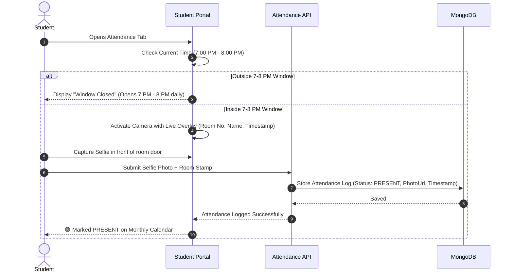
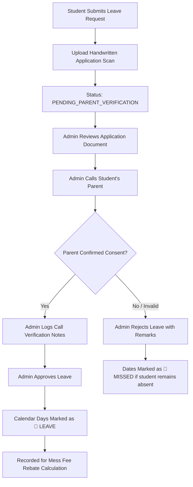
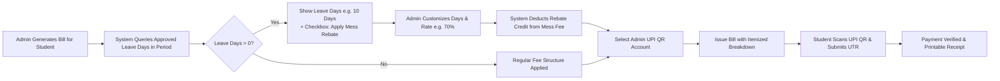
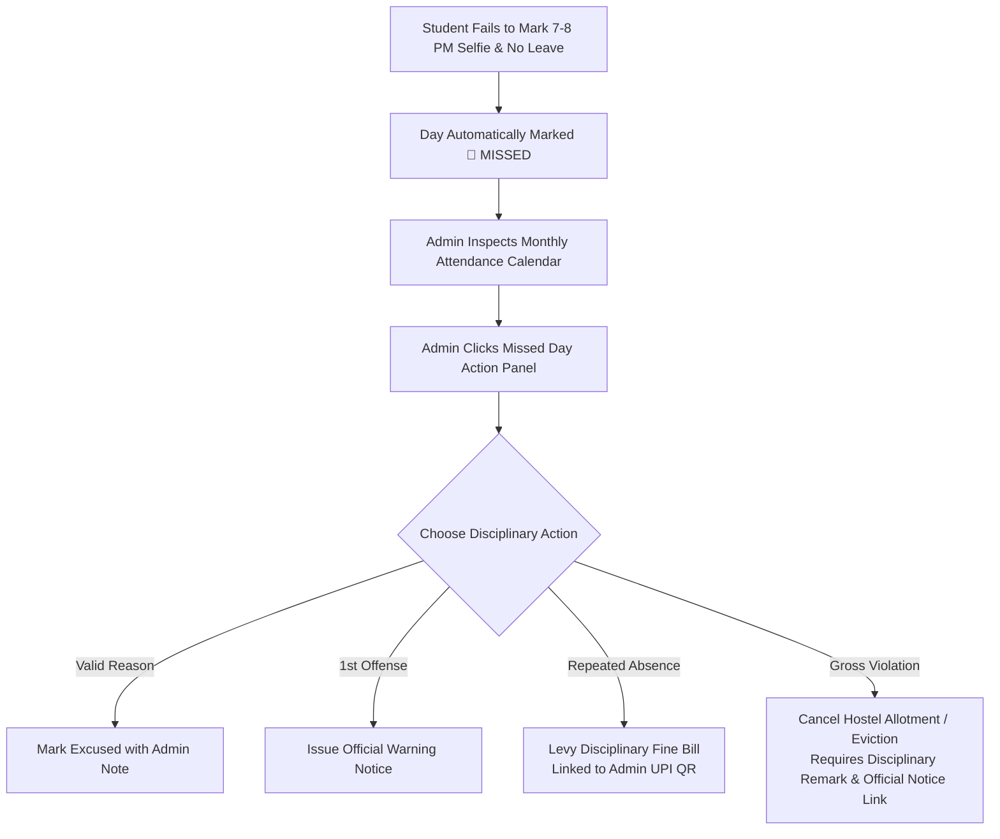

# Product Requirements Document (PRD)
# Modern Hostel Management System (HMS)

- **Architecture**: Full-Stack Next.js 14+ (App Router, Server Route Handlers / Server Actions, TypeScript)
- **Database**: MongoDB (via Mongoose ODM)
- **Styling**: Clean, Modern Custom CSS Design System
- **Document Status**: **LOCKED / APPROVED**
- **Location**: `/docs/PRD.md`

---

## 1. Executive Summary & Vision
The **Hostel Management System (HMS)** is a comprehensive, institutional-grade accommodation and residency lifecycle management platform built as a native Full-Stack Next.js application backed by MongoDB. It streamlines collegiate residential administration:
- Complete physical infrastructure modeling (Hostels $\rightarrow$ Blocks $\rightarrow$ Floors $\rightarrow$ Single/Double/Triple Rooms).
- Interactive visual floor/room matrix with direct 1-click room allotment.
- Targeted, time-limited student application forms configured for specific hostels with fee structure and rules document links.
- Multi-tier allotment lifecycle (`Pending` $\rightarrow$ `Eligible` $\rightarrow$ `Allotted` $\rightarrow$ `Cancelled/Evicted`).
- Flexible manual billing with refundable security deposits, 6-month cycles, and Admin-managed UPI QR payment routes.
- **Mess Rebate / Leave Deduction Engine**: Automatic detection of monthly approved leave days with optional, customizable mess fee deductions (e.g. 70% rebate with toggle and day count customization).
- **Smart Nightly Selfie Attendance**: Camera capture in front of room door with live room number stamp, restricted to evening roll-call window (7:00 PM – 8:00 PM).
- **Monthly Student Attendance Calendar View**: Interactive monthly grid displaying 🟢 Present, 🔵 Approved Leave, and 🔴 Missed / Unexcused days.
- **Handwritten Leave Application & Parent-Call Verification**: Student uploads handwritten leave letter; Admin calls parent, logs call verification notes, and approves/rejects.
- **Missed Attendance Disciplinary Engine**: Query student explanation, issue warnings, levy disciplinary fine bills (with UPI QR), or initiate eviction.
- Unified multi-identifier authentication (Roll No, Email, or Phone).

---

## 2. User Roles & Permission Matrix

| Role | Access Level | Primary Activities |
|---|---|---|
| **Admin / Chief Warden** | Full Control | Configure hostels, wings, floors, and rooms. Create hostel-targeted admission windows with time limits and notices. Review applications, 1-click allot beds, cancel/evict with notice links. Manage UPI IDs & QR codes. Generate flexible manual bills (refundable deposits, 6-month fees, fines). Calculate mess fee leave rebates. Review daily selfies, verify leaves by calling parents, inspect missed attendance, issue warnings/fines/evictions. |
| **Student** | Self-Service | Apply for designated open hostels, upload Aadhaar & photo, track live status (`Pending` $\rightarrow$ `Eligible` $\rightarrow$ `Allotted`), view assigned room & roommates, update registration number later. Pay bills via assigned UPI QR and submit UTR/receipt. Mark nightly attendance via room-selfie during the 7–8 PM window. Submit handwritten leave applications. View monthly attendance calendar and mess rebates. |
| **Viewer / Warden** | Read-Only | Real-time visual floor & room capacity matrix, student registry, emergency parent contact details, blood group, medical notes, and daily attendance roll-call logs. |

---

## 3. Core Functional Modules

### 3.1. Unified Multi-Identifier Authentication
- **Login Credentials**:
  - Identifier: **College Roll Number** OR **Email Address** OR **Mobile Phone Number**.
  - Password: Secure hashed password (bcrypt).
- **Role Redirection**:
  - `admin` $\rightarrow$ `/admin`
  - `student` $\rightarrow$ `/student`
  - `viewer` $\rightarrow$ `/viewer`
- **Demo Quick-Access Toolbar**:
  - 1-click quick-fill credentials for Admin, Student, and Viewer to enable frictionless testing and demonstrations.

---

### 3.2. Hostel Infrastructure & Visual Capacity Hierarchy
- **Hierarchical Structure**:
  - **Hostel**: e.g., *Girls Hostel*, *Boys Hostel*. Defines gender policy, blocks, and warden details.
  - **Block / Wing**: e.g., *Girls_Hostel_01*, *Block B*.
  - **Floors**: e.g., *Ground Floor (Rooms 0-100)*, *First Floor (Rooms 101-200)*, *Second Floor (Rooms 201-300)*.
  - **Rooms**: Configurable room capacity:
    - `SINGLE` (1 bed)
    - `DOUBLE` (2 beds)
    - `TRIPLE` (3 beds)
- **Visual Overview & 1-Click Allotment**:
  - High-level capacity cards: Total Beds, Occupied, Vacant, Occupancy %.
  - Interactive floor-by-floor visual room matrix:
    - Room cards show bed badges (e.g. Bed A: John Doe, Bed B: Available).
  - **1-Click Allotment from Room Card**: Click an available bed slot $\rightarrow$ a quick-modal lists `ELIGIBLE` applicants $\rightarrow$ 1-click allots the student to that bed.
  - **1-Click Allotment from Student Card**: Click *"Allot Room"* on any student card $\rightarrow$ floor and room selector popup opens $\rightarrow$ click vacant room card to complete allocation.

---

### 3.3. Admin Feature: Hostel-Specific Application Windows
When administrators create an admission/application window, they configure:
1. **Target Hostel Selection**:
   - Explicit dropdown to select which Hostel (e.g. *Girls_Hostel_01*, *Boys_Hostel_01*, etc.) the application form is being created for.
2. **Time Limit & Schedule**:
   - Start Date/Time and Expiry Deadline.
   - Live countdown timer displayed on the student portal.
3. **Audience Notice / Remark**:
   - Clear eligibility remark (e.g. *"Open for 1st Year B.Tech 2026 Batch"* or *"Lateral Entry & PG Students Only"*).
4. **Official Documentation Links**:
   - Direct link to official **Fee Structure Document**.
   - Direct link to official **Rules & Regulations / Code of Conduct Document**.

---

### 3.4. Comprehensive Student Application Form
The student form is dynamic and tailored to the selected hostel's admission round:
1. **Personal Information**:
   - Full Name, Date of Birth / Age, Gender.
   - Aadhaar Number & Aadhaar Card file upload.
   - Passport Photo file upload (with instant visual preview).
   - Student Mobile Number & Parents'/Guardian's Mobile Number.
   - Permanent & Current Address.
2. **Academic Information**:
   - College Roll Number (Required).
   - Registration Number (Optional initially; explicitly noted: *"Can be updated later from your student dashboard"*).
   - Branch / Department, Academic Session (e.g., 2025-2026), Semester.
   - **Conditional Academic History**:
     - If Entry Level / 12th: Asks for **12th Board Name** (CBSE, ICSE, State Board) & **Percentage (%)**.
     - If 2nd+ Year / Higher Semester: Asks for **Semester-wise SGPA** and **Cumulative CGPA**.
3. **Health & Special Needs**:
   - Blood Group (Optional: A+, B+, O+, AB+, etc.).
   - Medical Remarks / Pre-existing Health Conditions (Optional).
4. **Mandatory Documentation Links**:
   - Visual link buttons to inspect Fee Structure and Hostel Rules before submitting.

---

### 3.5. Allotment Lifecycle & State Machine
1. `PENDING`: Application submitted, awaiting administrative review.
2. `ELIGIBLE`: Admin verifies student details $\rightarrow$ Status becomes *"Eligible: Kindly pay fee and confirm your seat in hostel"*.
3. `ALLOTTED`: Payment confirmed & room assigned. Student dashboard displays assigned Hostel, Floor, Room Number, Bed ID, and roommate names.
4. `CANCELLED / EVICTED`: If a student's allotment is cancelled or evicted:
   - Admin must provide a **Disciplinary/Eviction Remark**.
   - Admin must provide a **Notice Document Link / Eviction Order URL**.
   - Student dashboard highlights an alert banner containing the remark and clickable notice link.
5. `REJECTED`: Application declined with administrative feedback.

---

### 3.6. Advanced Flexible Billing, Mess Rebates & Admin UPI QR
- **Versatile Billing Dimensions**:
  - Manual bill generation tailored for any scenario:
    - **One-Time Charges**: e.g., Admission Fee, Caution Money / Security Deposit (with clear **Refundable / Non-Refundable** tag).
    - **Periodic Cycles**: 6-Month term (Hostel Rent + Mess Fee), Yearly, or Custom Duration.
    - **Disciplinary / Fine**: Maintenance charges, late fee, property damage fine with specific justification remark.
  - **Applicable Recipients**:
    - **New Eligible Applicants**: Generate initial admission & seat confirmation bill (e.g. 1st semester hostel + refundable security deposit) so students pay and secure their hostel seat.
    - **Currently Allotted Students**: Generate regular 6-month term bills, fines, or maintenance fees.
  - **Itemized Charge Breakdown**: Description, Amount, Category, Refundable Flag (Yes/No), and Item Remark.
- **Mess Fee Leave Rebate Deduction**:
  - System automatically calculates the number of approved leave days the student took during the billing period/month.
  - In the bill generator, Admin sees:
    - `Approved Leaves in Period`: e.g. **10 Days**.
    - Toggle Checkbox: `[x] Apply Mess Fee Rebate for Approved Leave`.
    - Customization inputs:
      - `Deduct For Days`: editable number of days (e.g., 10 days or customize).
      - `Rebate Percentage / Rate`: editable percentage (default 70%, or custom 50%, 100%, or flat amount).
    - Automatically adds a negative line-item credit to the bill:
      - `Mess Rebate (10 Days @ 70% Daily Rate): -₹1,260`.
- **Admin UPI & Payment QR Account Management**:
  - Admin can configure and manage multiple official UPI payment destinations:
    - Account Name / Label (e.g. *"Hostel Main Account"*, *"Mess Facility Account"*, *"Security Deposit Account"*).
    - Payee Name (e.g. *"ABC College Hostel Welfare Trust"*).
    - UPI ID (e.g. `hosteladmin@sbi`).
    - QR Code Image (uploaded directly or auto-generated dynamic UPI QR).
  - **UPI Selection on Bill Creation**:
    - When generating a bill, Admin chooses which specific UPI QR account this payment should go to.
- **Student Payment & Receipt Experience**:
  - Displays the designated UPI QR code, UPI ID, and payable amount (with mess rebate credited).
  - Student scans and pays, enters their UTR / Transaction ID (with optional payment screenshot upload).
  - Bill moves to **Paid Bills** with official, printable **Payment Receipt**.

---

### 3.7. Smart Nightly Selfie Attendance System
- **Time Window Restriction**:
  - Standard roll-call window: **7:00 PM – 8:00 PM** daily.
  - Outside this window, the attendance capture button is locked with a message: *"Attendance window opens at 7:00 PM and closes at 8:00 PM daily"*.
- **Selfie Capture In Front of Room**:
  - Student opens camera module on mobile/laptop.
  - Live camera overlay visibly stamps:
    - **Room Number** (e.g. `Room 102 - First Floor`)
    - **Student Name & Roll Number**
    - **Live Date & Timestamp**
  - Student captures selfie standing in front of their room door.
  - Submits snapshot $\rightarrow$ records attendance entry with photo proof and timestamp.
  - Status automatically logged as `PRESENT`.

---

### 3.8. Monthly Attendance Calendar & Status Matrix
- **Visual Calendar Grid (Admin & Student Views)**:
  - Full monthly calendar (Days 1 to 28/30/31).
  - Day Status Badges:
    - 🟢 **Green**: `PRESENT` (Selfie captured & logged during window).
    - 🔵 **Blue**: `LEAVE` (Authorized leave with approved handwritten application & parent phone verification).
    - 🔴 **Red**: `MISSED` (Absent: student neither marked selfie attendance nor had approved leave).
    - ⚪ **Gray**: Upcoming days or holidays.
- **Monthly Metrics**: Total Days, Present Days, Approved Leaves, Missed Days, Attendance Rate (%).

---

### 3.9. Handwritten Leave Application & Parent Call Verification
- **Student Submission**:
  - Date range: From Date to To Date.
  - Reason for leave (e.g., family emergency, medical, festival, home travel).
  - Upload photo/scan of **Handwritten Leave Application Letter** (signed by student and parent).
  - Emergency contact phone number during leave.
  - Initial status: `PENDING_PARENT_VERIFICATION`.
- **Admin Verification & Approval Process**:
  - Admin views student's uploaded handwritten application document.
  - **Parent Phone Verification Panel**:
    - Displays Parent's Mobile Number from student profile.
    - Admin calls parent to verify consent and genuineness.
    - Admin logs verification outcome:
      - Call timestamp
      - Person spoken with (Father / Mother / Guardian)
      - Call verification notes & remarks
  - Admin clicks **Approve Leave** (dates are marked as 🔵 `LEAVE` on calendar and counted for mess rebate eligibility) or **Reject Leave** with reason.

---

### 3.10. Missed Attendance Investigation & Disciplinary Resolution
- When a student has 🔴 `MISSED` attendance:
  - Admin can inspect the missed day log.
  - **Investigation & Resolution Tools**:
    1. **Query Student**: Send explanation request / ask for reason.
    2. **Excused**: Mark as excused if genuine emergency occurred.
    3. **Official Disciplinary Warning**: Issue a formal warning visible on student portal.
    4. **Disciplinary Fine**: Directly opens the Bill Generator to levy a fine bill (payable via Admin's UPI QR).
    5. **Hostel Eviction / Cancellation**: For repeat unauthorized absences, initiate hostel seat cancellation with required remark and official notice link.

---

## 4. Comprehensive Architecture & Flow Diagrams

### 4.1. System Overview Architecture

```mermaid
flowchart TD
    subgraph Client["Frontend (Next.js 14+ App Router)"]
        A[Unified Login<br/>Roll No / Email / Phone]
        B[Admin Dashboard]
        C[Student Dashboard]
        D[Viewer / Warden Dashboard]
    end

    subgraph API["Next.js Server Route Handlers / Actions (/app/api)"]
        AuthAPI[/api/auth/]
        HostelAPI[/api/hostels/]
        AppWinAPI[/api/application-windows/]
        AppsAPI[/api/applications/]
        AllotAPI[/api/allotments/]
        BillAPI[/api/billing/<br/>+ Mess Rebate Engine]
        UpiAPI[/api/payment-accounts/]
        AttAPI[/api/attendance/]
        LeaveAPI[/api/leaves/]
        UploadAPI[/api/uploads/]
    end

    subgraph DB["MongoDB Database (Mongoose ODM)"]
        M_User[(Users)]
        M_Hostel[(Hostels & Rooms)]
        M_Win[(Application Windows)]
        M_App[(Applications)]
        M_Allot[(Allotments)]
        M_Bill[(Bills & Payments)]
        M_UPI[(UPI Accounts)]
        M_Att[(Attendance Logs)]
        M_Leave[(Leave Requests)]
    end

    Client --> API
    API --> DB
```

---

### 4.2. Nightly Selfie Attendance & Window State Machine



---

### 4.3. Handwritten Leave & Parent Call Verification Workflow



---

### 4.4. Mess Fee Leave Rebate & Billing Workflow



---

### 4.5. Missed Attendance Disciplinary Resolution Pipeline



---

## 5. Technical Specifications & Security Standards
- **Framework**: Next.js 14+ (App Router).
- **Database**: MongoDB with Mongoose ODM (configurable via `MONGODB_URI` with built-in memory/local fallback).
- **Selfie Attendance**: MediaDevices Web API camera capture with canvas timestamp/room overlay stamping.
- **Authentication**: JWT token with role guards (`admin`, `student`, `viewer`) and multi-identifier lookup (roll number, email, phone).
- **Passwords**: Hashed with `bcryptjs`.
- **Validation**: Schema-level validation and route handler validation.
